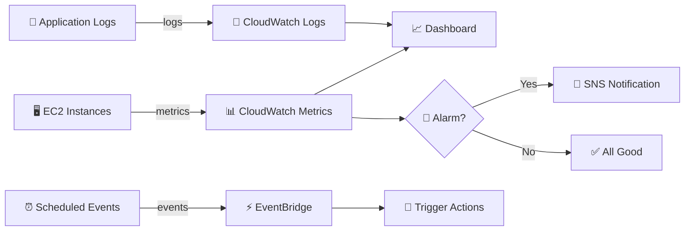
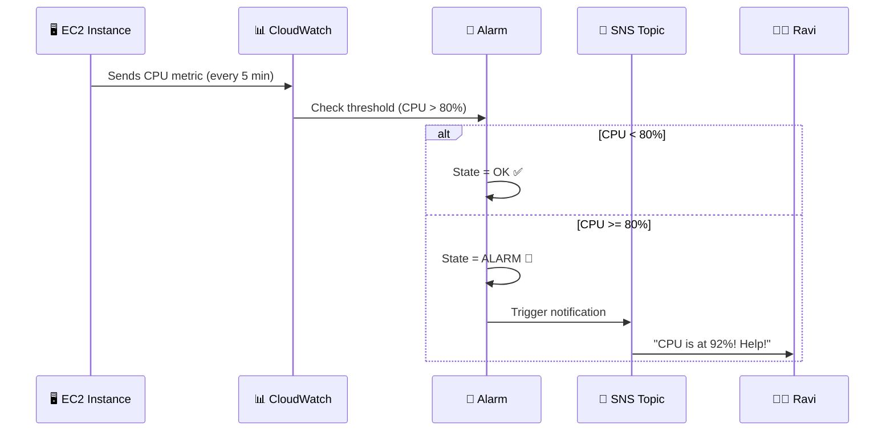
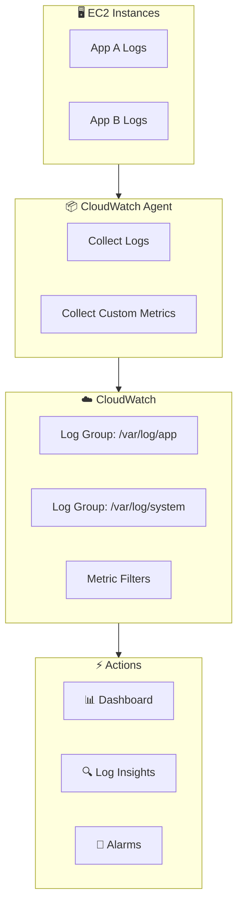

# ☁️ AWS CloudWatch - Your Eyes on the Cloud

> *"You can't fix what you can't see!"* - Every AWS engineer at 3 AM during an outage 😅

---

## 🤔 What is CloudWatch?

Hey Ravi! Imagine you're running a restaurant but you have **zero visibility** into what's happening in the kitchen. No temperature gauges, no order tracking, no idea if the fridge is working. Sounds terrifying, right?

**Amazon CloudWatch** is a **monitoring and observability service** that gives you superpowers to watch over your AWS resources and applications. It collects **metrics**, **logs**, **events**, and lets you **set alarms** when things go sideways.

Think of it as your **mission control center** for everything AWS! 🎯

---

## ❓ Why Do We Need CloudWatch?

| Problem | CloudWatch Solution |
|---------|-------------------|
| "Is my server overloaded?" | 📊 CPU/Memory Metrics |
| "Why did my app crash?" | 📝 Log Analysis |
| "Something's wrong at 3 AM!" | 🔔 Alarms & Notifications |
| "I need to see everything at once!" | 📈 Dashboards |
| "React to EC2 state changes!" | ⚡ Events / EventBridge |

Without CloudWatch, you're basically flying blind. With it, you're a **data-driven superhero**! 🦸

---

## 🏥 Real-World Analogy: Hospital Monitoring System

Ravi, picture this:

CloudWatch is like a **hospital patient monitoring system**:

| Hospital | CloudWatch |
|----------|------------|
| 💓 Heart rate monitor | 📊 CPU Utilization metric |
| 🌡️ Temperature sensor | 📊 Memory Usage metric |
| 🔔 Nurse call button | 🔔 CloudWatch Alarm |
| 📋 Patient chart history | 📝 CloudWatch Logs |
| 📺 Vitals dashboard screen | 📊 CloudWatch Dashboard |
| 🚨 Code Blue alert | 📧 SNS notification |

When a patient's vitals go out of range, the alarm rings, the nurse gets paged, and action is taken. **CloudWatch does the exact same thing for your AWS resources!**

---

## ⚙️ How CloudWatch Works

CloudWatch has several key components working together:

**The workflow is simple:**
1. **Collect** → AWS services send metrics/logs to CloudWatch
2. **Monitor** → You visualize data on dashboards
3. **Detect** → Alarms watch for threshold breaches
4. **React** → Notifications trigger actions (SNS, auto-scaling, etc.)

---

## 🌟 Key Features

### 📊 Metrics
- **Built-in metrics** for EC2, RDS, S3, Lambda, and 90+ AWS services
- **Custom metrics** via CloudWatch Agent or API (`put-metric-data`)
- **Dimensions** to slice and dice (e.g., InstanceId, AutoScalingGroup)
- **1-second high-resolution metrics** for precision monitoring

### 🔔 Alarms
- Set thresholds on metrics (e.g., CPU > 80%)
- States: `OK` → `ALARM` → `INSUFFICIENT_DATA`
- Actions: SNS notifications, Auto Scaling, EC2 actions
- **Composite alarms** to combine multiple conditions

### 📝 Logs
- **Log Groups** → logical grouping (e.g., `/aws/ec2/myapp`)
- **Log Streams** → sequence of log events from a source
- **Log Insights** → SQL-like queries to search logs 🔍
- **Subscription Filters** → stream logs to Lambda, Kinesis, or Elasticsearch

### 📊 Dashboards
- Customizable visualizations of metrics
- Cross-account and cross-region views
- Share dashboards with your team

### ⚡ Events / EventBridge
- React to AWS resource changes in near real-time
- Create rules like "When EC2 stops, notify me"
- Schedule tasks (cron-based)

---

## 🏗️ Architecture Overview

### Alarm Workflow

### Log Collection Architecture

---

## 🎯 Common Use Cases

| Use Case | How CloudWatch Helps |
|----------|---------------------|
| 🖥️ EC2 Monitoring | Track CPU, Network, Disk usage |
| 📱 Application Monitoring | Custom metrics from your code |
| 🗄️ RDS Monitoring | Database connections, query performance |
| 📁 S3 Monitoring | Request metrics, error rates |
| ⚡ Lambda Monitoring | Invocations, duration, errors |
| 🔒 Security | Monitor root login attempts |
| 💰 Cost Control | Track API calls and resource usage |

---

## ✅ Best Practices

| Practice | Why It Matters |
|----------|---------------|
| 🚨 Create alarms for CPU/Memory | Catch issues before users notice |
| 📝 Set up Log Groups | Organize logs for easy searching |
| 📊 Build Dashboards | Single pane of glass for your team |
| 📦 Install CloudWatch Agent | Get metrics logs alone can't provide |
| 🔍 Use Log Insights | Query logs like a pro (saves hours!) |
| 🏷️ Use Dimensions | Filter metrics by instance, environment, etc. |
| 💰 Use Standard Metrics | Detailed monitoring costs extra |
| 🔗 Integrate with EventBridge | Automate responses to events |

---

## ❌ Common Mistakes

| Mistake | What Happens | Fix |
|---------|-------------|-----|
| 😴 Not setting alarms | Issues go unnoticed until outage | Create alarms for critical metrics |
| 💸 Enabling detailed monitoring everywhere | Unexpected costs | Use detailed only where needed |
| 📭 Ignoring Log Insights | Manual log searching takes forever | Learn Log Insights queries |
| 🏷️ Not using dimensions | Can't filter by instance/service | Add dimensions to custom metrics |
| 🗑️ No log retention policy | Logs pile up forever, costs explode | Set retention (30/90/365 days) |
| 🚫 Not installing CloudWatch Agent | Missing OS-level metrics | Install agent on EC2 instances |

---

## 🎤 Interview Questions

### 1️⃣ What is the difference between CloudWatch Metrics and CloudWatch Logs?

**Answer:** CloudWatch **Metrics** are numerical data points (CPU, memory, network) that track performance over time. CloudWatch **Logs** are textual records from applications and systems. Metrics give you the "what" (CPU is high), Logs give you the "why" (OOM error in the app).

### 2️⃣ How do you get memory utilization metrics for an EC2 instance?

**Answer:** Memory metrics are **not** provided by default. You need to install the **CloudWatch Agent** on the EC2 instance, configure it to collect memory metrics, and it will send them to CloudWatch. Default metrics only include CPU, network, disk, etc.

### 3️⃣ What are the three states of a CloudWatch Alarm?

**Answer:**
- **OK** → Metric is within the threshold (all good!)
- **ALARM** → Metric breached the threshold (alert!)
- **INSUFFICIENT_DATA** → Not enough data to determine state (new or missing data)

### 4️⃣ Can CloudWatch Alarms trigger multiple actions?

**Answer:** Yes! A single alarm can trigger **multiple SNS topics** or actions. For example, when CPU > 80%, you can: 1) Send an email, 2) Trigger Auto Scaling, 3) Invoke a Lambda function. You can also create **composite alarms** to combine multiple alarm conditions.

### 5️⃣ What is the difference between CloudWatch Logs and CloudWatch Logs Insights?

**Answer:** **CloudWatch Logs** stores your log data. **CloudWatch Logs Insights** is an interactive query engine that lets you search and analyze logs using a SQL-like query language. Instead of manually browsing through thousands of log lines, you write a query and get instant results. It's like using Ctrl+F on steroids! 💪

---

## 📋 Summary

| Component | Purpose |
|-----------|---------|
| 📊 **Metrics** | Numerical monitoring data |
| 🔔 **Alarms** | Alert when thresholds are breached |
| 📝 **Logs** | Store and search textual data |
| 📊 **Dashboards** | Visualize everything in one place |
| ⚡ **Events** | React to AWS resource changes |

CloudWatch is your **best friend** for keeping your AWS infrastructure healthy, performing well, and secure. Set it up early, set up alarms, and sleep peacefully at night! 😴

---

## ➡️ Next Up: [16 - CloudTrail](../16%20-%20CloudTrail/README.md)

> Now that we can *monitor* our systems, let's learn about **tracking WHO did WHAT** with CloudTrail! 🕵️
