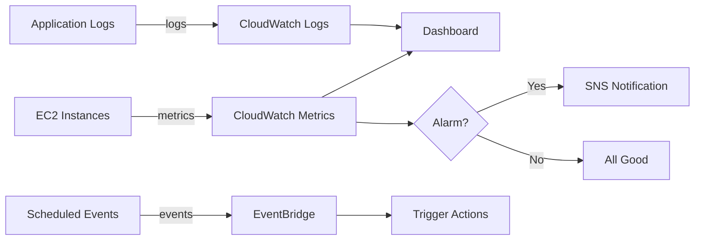
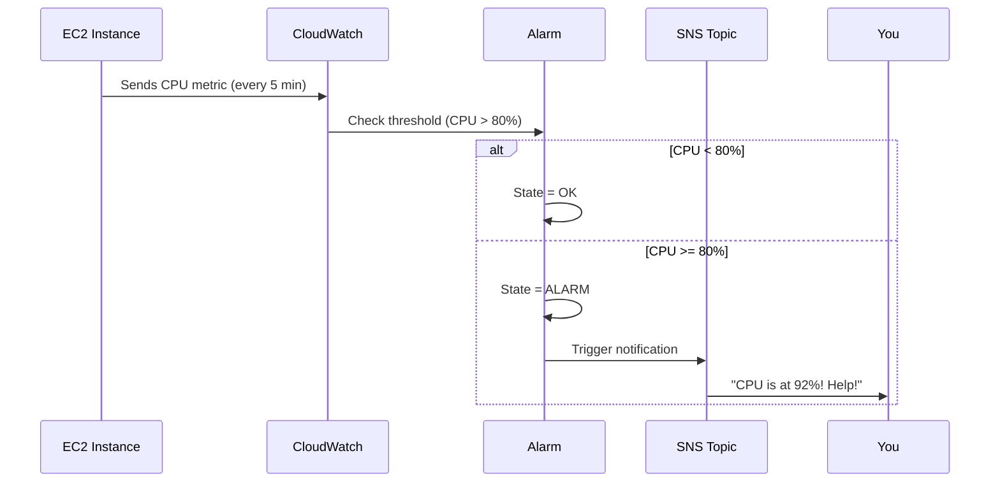
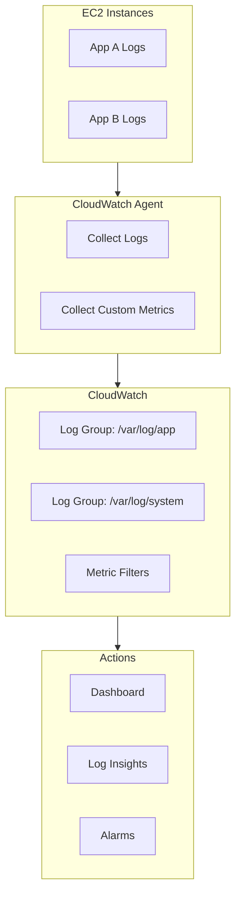

# AWS CloudWatch - Your Eyes on the Cloud

> *"You can't fix what you can't see!"* - Every AWS engineer at 3 AM during an outage

---

## CloudWatch Architecture Overview

> *Amazon CloudWatch collects metrics, logs, and events from your AWS resources and applications.*

---

## What is CloudWatch?

Hey Ravi! Imagine you're running a restaurant but you have **zero visibility** into what's happening in the kitchen. No temperature gauges, no order tracking, no idea if the fridge is working. Sounds terrifying, right?

**Amazon CloudWatch** is a **monitoring and observability service** that gives you superpowers to watch over your AWS resources and applications. It collects **metrics**, **logs**, **events**, and lets you **set alarms** when things go sideways.

Think of it as your **mission control center** for everything AWS!

---

## Feynman Test — Can You Explain It Simply?

> **CloudWatch is like the dashboard in your car.** Speedometer (metrics), warning lights (alarms), GPS tracker (logs). If something goes wrong, the alarm beeps.

The car dashboard analogy maps perfectly:
- **Speedometer** = CloudWatch Metrics (CPU at 80%, memory at 70%)
- **Warning lights** = CloudWatch Alarms (alert when CPU > 80%)
- **GPS tracker** = CloudWatch Logs (record everything that happened)
- **Dashboard panel** = CloudWatch Dashboards (visualize everything)
- **Mechanic's diagnostic tool** = CloudWatch Logs Insights (search logs like a pro)

If someone asks "What's CloudWatch?" and you say "It's like the dashboard in my car that tells me if something's about to break," they'll immediately get it.

---

## Why Do We Need CloudWatch?

| Problem | CloudWatch Solution |
|---------|-------------------|
| "Is my server overloaded?" | CPU/Memory Metrics |
| "Why did my app crash?" | Log Analysis |
| "Something's wrong at 3 AM!" | Alarms & Notifications |
| "I need to see everything at once!" | Dashboards |
| "React to EC2 state changes!" | Events / EventBridge |

Without CloudWatch, you're basically flying blind. With it, you're a **data-driven superhero**!

---

## Real-World Analogy: Hospital Monitoring System

Ravi, picture this:

CloudWatch is like a **hospital patient monitoring system**:

| Hospital | CloudWatch |
|----------|------------|
| Heart rate monitor | CPU Utilization metric |
| Temperature sensor | Memory Usage metric |
| Nurse call button | CloudWatch Alarm |
| Patient chart history | CloudWatch Logs |
| Vitals dashboard screen | CloudWatch Dashboard |
| Code Blue alert | SNS notification |

When a patient's vitals go out of range, the alarm rings, the nurse gets paged, and action is taken. **CloudWatch does the exact same thing for your AWS resources!**

---

## How CloudWatch Works

CloudWatch has several key components working together:

**The workflow is simple:**
1. **Collect** → AWS services send metrics/logs to CloudWatch
2. **Monitor** → You visualize data on dashboards
3. **Detect** → Alarms watch for threshold breaches
4. **React** → Notifications trigger actions (SNS, auto-scaling, etc.)

---

## Key Features

### Metrics
- **Built-in metrics** for EC2, RDS, S3, Lambda, and 90+ AWS services
- **Custom metrics** via CloudWatch Agent or API (`put-metric-data`)
- **Dimensions** to slice and dice (e.g., InstanceId, AutoScalingGroup)
- **1-second high-resolution metrics** for precision monitoring

### Alarms
- Set thresholds on metrics (e.g., CPU > 80%)
- States: `OK` → `ALARM` → `INSUFFICIENT_DATA`
- Actions: SNS notifications, Auto Scaling, EC2 actions
- **Composite alarms** to combine multiple conditions

### Logs
- **Log Groups** → logical grouping (e.g., `/aws/ec2/myapp`)
- **Log Streams** → sequence of log events from a source
- **Log Insights** → SQL-like queries to search logs
- **Subscription Filters** → stream logs to Lambda, Kinesis, or Elasticsearch

### Dashboards
- Customizable visualizations of metrics
- Cross-account and cross-region views
- Share dashboards with your team

### Events / EventBridge
- React to AWS resource changes in near real-time
- Create rules like "When EC2 stops, notify me"
- Schedule tasks (cron-based)

---

## Architecture Overview

### Alarm Workflow

### Log Collection Architecture

---

## Common Use Cases

| Use Case | How CloudWatch Helps |
|----------|---------------------|
| EC2 Monitoring | Track CPU, Network, Disk usage |
| Application Monitoring | Custom metrics from your code |
| RDS Monitoring | Database connections, query performance |
| S3 Monitoring | Request metrics, error rates |
| Lambda Monitoring | Invocations, duration, errors |
| Security | Monitor root login attempts |
| Cost Control | Track API calls and resource usage |

---

## Best Practices

| Practice | Why It Matters |
|----------|---------------|
| Create alarms for CPU/Memory | Catch issues before users notice |
| Set up Log Groups | Organize logs for easy searching |
| Build Dashboards | Single pane of glass for your team |
| Install CloudWatch Agent | Get metrics logs alone can't provide |
| Use Log Insights | Query logs like a pro (saves hours!) |
| Use Dimensions | Filter metrics by instance, environment, etc. |
| Use Standard Metrics | Detailed monitoring costs extra |
| Integrate with EventBridge | Automate responses to events |

---

## Common Mistakes

| Mistake | What Happens | Fix |
|---------|-------------|-----|
| Not setting alarms | Issues go unnoticed until outage | Create alarms for critical metrics |
| Enabling detailed monitoring everywhere | Unexpected costs | Use detailed only where needed |
| Ignoring Log Insights | Manual log searching takes forever | Learn Log Insights queries |
| Not using dimensions | Can't filter by instance/service | Add dimensions to custom metrics |
| No log retention policy | Logs pile up forever, costs explode | Set retention (30/90/365 days) |
| Not installing CloudWatch Agent | Missing OS-level metrics | Install agent on EC2 instances |

---

## Memory Tricks — Lock These Into Your Brain

Use these mnemonics to remember CloudWatch concepts instantly:

- **"CloudWatch = 'Cloud Watchdog'"** — it watches everything and barks (alarms) when something is wrong. Picture a loyal dog guarding your AWS resources.
- **"Metrics = numbers (CPU = 80%). Alarms = thresholds (alert if CPU > 80%). Logs = text (application output)."** Three words, three concepts, done.
- **"CloudWatch vs CloudTrail: CW = 'HOW is my system performing?' CT = 'WHO did WHAT?'"** This is the single most important distinction to memorize.

### Visual Association Trick

Picture a security guard watching a building:
- **Metrics** = The security cameras recording numbers (how many people entered, how hot it is inside)
- **Alarms** = The motion detector that rings when someone breaks a window
- **Logs** = The security guard's written notebook entry: "10:45 PM — door opened, person in red shirt entered"
- **Dashboard** = The security room with all the screens showing live feeds
- **CloudTrail** = A separate system that records every badge swipe and key turn (WHO did WHAT, not HOW the building is performing)

---

## Interview Traps — Don't Fall For These!

These questions trip up even experienced engineers. Study carefully.

### TRAP 1: "What's the difference between CloudWatch and CloudTrail?"

> CloudWatch monitors PERFORMANCE (metrics, logs, alarms). CloudTrail records API calls (AUDIT). CloudWatch = health monitor. CloudTrail = security camera.

**Why it's a trap:** They sound similar but serve completely different purposes. CloudWatch answers "Is my system healthy?" CloudTrail answers "Who deleted my S3 bucket at 2 AM?" Mixing them up is the fastest way to lose credibility in an interview.

**Pro tip:** If the question mentions "performance," "metrics," "alarms," or "monitoring" — it's CloudWatch. If it mentions "audit," "API calls," "who did what," or "compliance" — it's CloudTrail.

### TRAP 2: "How do you monitor an EC2 instance?"

> CloudWatch Agent for custom metrics, CloudWatch Logs for application logs, CloudWatch Alarms for thresholds.

**Why it's a trap:** The obvious answer is "CloudWatch." But the REAL answer involves THREE things:
1. **CloudWatch Agent** — installs on the EC2 to collect OS-level metrics (memory, disk, processes)
2. **CloudWatch Logs** — collects application log files
3. **CloudWatch Alarms** — triggers when thresholds are breached

Just saying "CloudWatch" is like saying "I drive a car" when someone asks how you get to work. You need to be specific about WHICH parts of CloudWatch.

### TRAP 3: "How do you get memory utilization for EC2?"

> You need the CloudWatch Agent. Default EC2 metrics do NOT include memory.

**Why it's a trap:** Many engineers assume EC2 automatically reports memory to CloudWatch. It doesn't. You MUST install the CloudWatch Agent on each instance. This is a very common interview gotcha.

---

## Think About It — Pause and Reflect

Before moving on, sit with these questions for 30 seconds each:

1. You get a CloudWatch alarm at 3 AM saying CPU is at 95%. What's your first step? Do you wake up and SSH into the instance, or do you check the dashboard first?
2. Your company wants to monitor 500 EC2 instances. Would you create 500 separate alarms, or is there a smarter approach? (Hint: think about SNS and Lambda)
3. If your application logs are 50 GB per day, would you keep them forever? What's the cost implication?
4. How would you explain CloudWatch vs CloudTrail to a non-technical manager who asks "Do we really need both?"
5. Your startup has no monitoring. Where would you start — metrics, logs, or alarms? Why?

---

## Story Time — The 3 AM Wake-Up Call

Ravi was a junior cloud engineer at a fintech startup called "PayQuick." The company processed payments 24/7, and nobody had set up CloudWatch alarms.

One Tuesday at 3 AM, the on-call engineer's phone buzzed. A customer reported "payments are failing." The engineer logged in to find:
- The primary database was at 98% CPU
- Application logs showed thousands of "connection timeout" errors
- The disk was 99% full
- Nobody had been alerted because... no alarms existed

**The damage:**
- 3 hours of downtime
- $50,000 in lost transactions
- Angry customer emails

**What Ravi built the next week:**
1. Installed CloudWatch Agent on all EC2 instances — now they had memory and disk metrics
2. Created CloudWatch Alarms: CPU > 80% → email, CPU > 90% → SMS, Disk > 85% → SMS + Lambda to auto-expand
3. Set up CloudWatch Logs with a 30-day retention policy — no more cost explosion
4. Built a CloudWatch Dashboard showing real-time health of all services
5. Configured EventBridge to auto-restart any EC2 instance that went unresponsive

**The result:** The next time CPU spiked to 85%, Ravi got an email at 9:02 AM. He scaled up the instance by 9:15 AM. The customers never noticed.

**The lesson:** CloudWatch isn't a nice-to-have — it's your early warning system. Set it up BEFORE things break, not after.

---

## One-Liner Answers — For Quick Recall

| Question | One-Liner |
|----------|-----------|
| What is CloudWatch? | Monitoring and observability service for AWS resources |
| What are Metrics? | Numerical data points (CPU, memory, network) tracked over time |
| What are Alarms? | Threshold watchers that trigger actions when breached |
| What are Logs? | Textual records from applications and systems |
| CW vs CloudTrail? | CW = HOW is performance? CT = WHO did WHAT? |
| Alarm states? | OK, ALARM, INSUFFICIENT_DATA |
| Memory metrics? | Need CloudWatch Agent — not included by default |
| Log Insights? | SQL-like query engine for searching logs |
| Dashboards? | Custom visualizations of metrics across services |
| EventBridge? | React to AWS resource changes in near real-time |

---

## 80/20 Rule — The Vital Few

**80% of CloudWatch interview questions and real-world usage boil down to these 20% of concepts:**

1. **Metrics vs Logs vs Alarms** — Know the difference cold. Metrics = numbers, Logs = text, Alarms = threshold triggers.
2. **CloudWatch vs CloudTrail** — THE #1 interview question. CW = performance monitoring. CT = API audit trail.
3. **CloudWatch Agent** — Required for memory and custom metrics. Default EC2 metrics don't include memory.
4. **Alarm Actions** — Alarms can trigger SNS, Auto Scaling, or Lambda. One alarm can do multiple things.
5. **Log Retention** — Set it. Logs stored forever = infinite cost. 30/90/365 days are typical.

**If you master these 5 things, you can handle 80% of CloudWatch-related tasks and questions.**

---

## Summary

| Component | Purpose |
|-----------|---------|
| **Metrics** | Numerical monitoring data |
| **Alarms** | Alert when thresholds are breached |
| **Logs** | Store and search textual data |
| **Dashboards** | Visualize everything in one place |
| **Events** | React to AWS resource changes |

CloudWatch is your **best friend** for keeping your AWS infrastructure healthy, performing well, and secure. Set it up early, set up alarms, and sleep peacefully at night!

---

## Next Up: [16 - CloudTrail](../16%20-%20CloudTrail/README.md)

> Now that we can *monitor* our systems, let's learn about **tracking WHO did WHAT** with CloudTrail!
