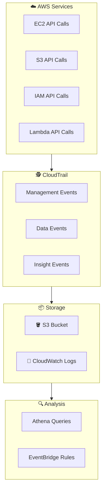
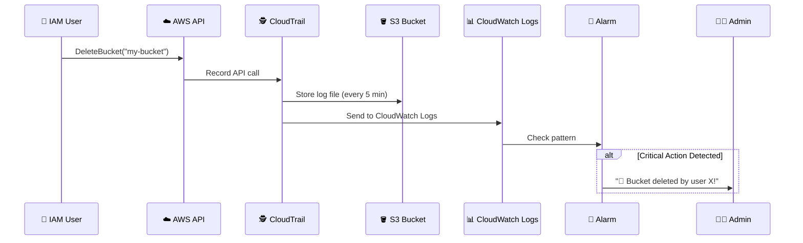

# 🕵️ AWS CloudTrail - Your AWS CCTV Camera

> *"Who deleted my S3 bucket at 2 AM?!"* - Every AWS admin during an incident 😱

---

## 🤔 What is CloudTrail?

Hey Ravi! So CloudWatch tells you *how your system is performing*, but what about **who's actually doing stuff** in your AWS account? That's where CloudTrail comes in!

**AWS CloudTrail** is an **audit trail service** that records every API call made in your AWS account. It logs:

- **WHO** made the call (IAM user, role, or root)
- **WHAT** action was performed (e.g., `RunInstances`, `DeleteBucket`)
- **WHEN** it happened (timestamp)
- **FROM WHERE** (source IP address)
- **WHAT RESULT** (success or failure)

Think of it as your **security camera for AWS**! 📹

---

## ❓ Why Do We Need CloudWatch vs CloudTrail?

Ravi, this is the **#1 confusion** in interviews! Let me clear it up:

| CloudWatch 📊 | CloudTrail 🕵️ |
|---------------|----------------|
| "How is my system **performing**?" | "**Who** did **what**?" |
| Metrics, Logs, Alarms | API call audit logs |
| Operational monitoring | Security & compliance |
| CPU is at 90% | User X deleted S3 bucket |
| Performance-focused | Accountability-focused |

**Think of it this way:** CloudWatch is your car's dashboard (speed, fuel). CloudTrail is the dashcam (who was driving and where they went).

---

## 📹 Real-World Analogy: CCTV Camera System

Ravi, imagine your office building:

| Office Building | CloudTrail |
|----------------|------------|
| 📹 CCTV cameras | 📝 Trail recording API calls |
| 🚪 Door access logs | 📝 Who logged in and when |
| 📋 Visitor sign-in sheet | 📝 Source IP addresses |
| 🎥 Security footage storage | 📦 S3 bucket for log files |
| 🔍 Investigating an incident | 🔍 Searching trail logs |
| 🚨 Breaking glass alarm | 📧 CloudWatch Logs alerts |

When something goes wrong, you **check the footage**. CloudTrail is that footage for your AWS account!

---

## ⚙️ How CloudTrail Works

**The flow is simple:**
1. **Someone makes an API call** (e.g., launches an EC2 instance)
2. **CloudTrail records it** (who, what, when, where)
3. **Logs are stored** in S3 (and optionally CloudWatch Logs)
4. **You analyze** the logs for compliance, security, or debugging

---

## 🌟 Key Features

### 📋 Trail Types

| Event Type | What It Records | When to Use |
|-----------|----------------|-------------|
| **Management Events** | Control plane operations (CreateUser, RunInstances) | Always (default) |
| **Data Events** | Data plane operations (S3 GetObject, Lambda Invoke) | When you need S3/Lambda audit |
| **Insight Events** | Unusual activity detection (API call spikes) | Security monitoring |

### 🔑 Key Concepts

- **Trail** → A configuration that defines what events to log
- **Organization Trail** → One trail for all accounts in AWS Organizations
- **Multi-region Trail** → Records events from ALL regions
- **Log File Validation** → Ensures logs haven't been tampered with (digest files)

### 📦 Where Logs Go

| Destination | Purpose |
|------------|---------|
| **S3 Bucket** | Long-term storage, compliance, cost-effective |
| **CloudWatch Logs** | Real-time monitoring, search, alarms |
| **EventBridge** | React to API calls in real-time |

---

## 🏗️ Architecture Overview

### CloudTrail + CloudWatch Integration

### CloudTrail vs AWS Config

| Feature | CloudTrail 🕵️ | AWS Config 📋 |
|---------|---------------|--------------|
| **Tracks** | API calls (actions) | Configuration state |
| **Shows** | WHO did WHAT | WHAT changed |
| **Example** | "User A deleted instance i-123" | "Instance changed from t2.micro to t2.large" |
| **Timing** | When the action happened | Point-in-time snapshots |
| **Use Case** | Audit trail | Compliance checking |

---

## 🎯 Common Use Cases

| Use Case | How CloudTrail Helps |
|----------|---------------------|
| 🔒 Security Investigation | Who accessed the compromised resource? |
| 📋 Compliance (PCI, HIPAA) | Prove who made changes and when |
| 🐛 Troubleshooting | "Who changed the security group?" |
| 🏢 Multi-account Auditing | Centralized logging for all accounts |
| 💰 Cost Analysis | Track API calls to understand usage |
| 🔔 Real-time Alerts | Notify when critical actions happen |

---

## ✅ Best Practices

| Practice | Why It Matters |
|----------|---------------|
| 🌍 Enable in ALL regions | Catch unauthorized cross-region activity |
| 🪣 Log to S3 | Long-term storage, compliance requirement |
| 🔐 Enable log file verification | Prove logs haven't been modified |
| 📝 Send to CloudWatch Logs | Real-time monitoring and alerts |
| 🏢 Use Organization Trail | One trail for all accounts |
| 📊 Enable Insights Events | Detect unusual API call patterns |
| 🔑 Use IAM roles, not root | Follow least privilege principle |
| 💰 Understand pricing | Insights events and data events cost extra |

---

## ❌ Common Mistakes

| Mistake | What Happens | Fix |
|---------|-------------|-----|
| 🚫 Not enabling CloudTrail | No audit trail = no accountability | Enable in all regions immediately |
| 🌍 Only logging one region | Blind spots in other regions | Use multi-region trail |
| 🗑️ Not setting log retention | S3 costs pile up forever | Set lifecycle policies |
| 📭 Ignoring data events | Missing S3/Lambda audit logs | Enable for sensitive buckets |
| 🔓 Using root credentials | Massive security risk | Use IAM users with MFA |
| 📋 Not validating logs | Can't prove integrity | Enable log file validation |

---

## 🎤 Interview Questions

### 1️⃣ What is the difference between CloudTrail and CloudWatch?

**Answer:** **CloudTrail** records **WHO did WHAT** (API calls/audit trail). **CloudWatch** monitors **HOW your system is performing** (metrics, logs, alarms). CloudTrail is for security/compliance. CloudWatch is for operational monitoring. They complement each other!

### 2️⃣ Can CloudTrail log data events? When would you use them?

**Answer:** Yes! **Data Events** track S3 object-level operations and Lambda invocations. Use them when you need to know **who accessed specific files** in S3 or **who invoked which Lambda function**. They're more expensive than Management Events, so only enable them where needed.

### 3️⃣ How do you ensure CloudTrail logs haven't been tampered with?

**Answer:** Enable **Log File Validation** which creates **digest files** using SHA-256 hashing. You can use the AWS CLI command `aws cloudtrail validate-logs` to verify that log files haven't been modified since they were delivered.

### 4️⃣ What is the difference between a single-region and multi-region trail?

**Answer:** A **single-region trail** only records events from the region where it's created. A **multi-region trail** records events from **ALL AWS regions**. Always use multi-region trails so you don't have blind spots! You can also create an **Organization trail** to log events from all accounts in your AWS Organization.

### 5️⃣ How can you use CloudTrail with CloudWatch Logs for real-time alerting?

**Answer:** Configure your CloudTrail trail to **send logs to CloudWatch Logs**. Then create **metric filters** (e.g., filter for "ConsoleLogin" failures) and set up **CloudWatch Alarms** on those filters. When the alarm triggers, send an SNS notification to your security team. This gives you **real-time security alerting!**

---

## 📋 Summary

| Component | Purpose |
|-----------|---------|
| 🕵️ **Trail** | Configuration for what to log |
| 📋 **Management Events** | Control plane API calls |
| 📊 **Data Events** | Data plane API calls |
| 🔍 **Insight Events** | Unusual activity detection |
| 🪣 **S3 Storage** | Long-term log storage |
| 📝 **CloudWatch Logs** | Real-time monitoring |

CloudTrail is your **security blanket** for AWS. Without it, you're guessing. With it, you have **evidence** of everything that happened. Enable it everywhere, log everything, and you'll thank yourself during the next security audit! 🔐

---

## ➡️ Next Up: [17 - Systems Manager, Secrets Manager and Parameter Store](../17%20-%20Systems%20Manager%2C%20Secrets%20Manager%20and%20Parameter%20Store/README.md)

> Now that we can monitor and audit, let's learn about **managing servers and secrets** at scale! 🔧🔐
