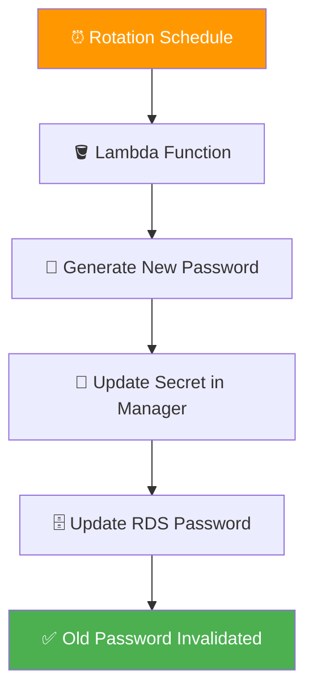
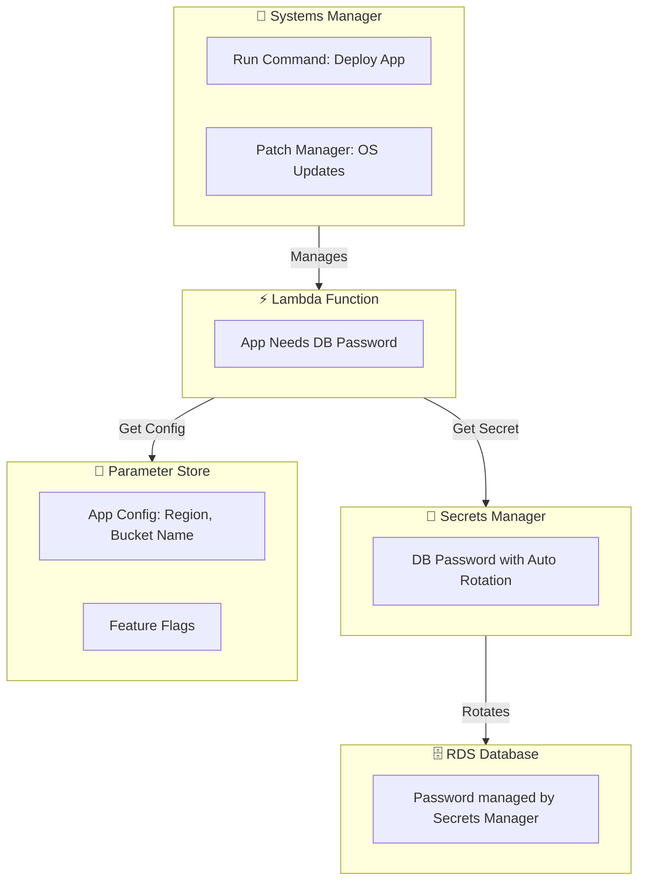

# 🔧 AWS SSM, Secrets Manager & Parameter Store - Ops Management Trio


> *"Stop hardcoding your passwords in the code, Ravi!"* - Every security engineer ever 🤦

---

## Systems Manager Architecture Overview


> *AWS Systems Manager provides a unified user interface to track and resolve operational issues across your AWS applications and infrastructure.*

---

## What Are These Three Services?

Hey Ravi! Today we're covering three services that solve two big problems: **managing servers at scale** and **keeping secrets safe**.

| Service | What It Does | Analogy |
|---------|-------------|---------|
| 🔧 **Systems Manager (SSM)** | Manage EC2 instances at scale | 🎮 Remote control for all servers |
| 🔐 **Secrets Manager** | Store & rotate secrets automatically | 🏦 Safe with auto-rotating locks |
| 📁 **Parameter Store** | Store config data & simple secrets | 🗄️ Labeled file cabinet |

---

## 🔧 Systems Manager (SSM)

### What is SSM?

SSM is your **one-stop shop for operational management** of EC2 instances and on-premises servers. Instead of SSH-ing into each server individually, you manage them all from one place!

### Key Features

| Feature | What It Does |
|---------|-------------|
| 🖥️ **Run Command** | Execute commands on multiple instances at once |
| 🔒 **Session Manager** | No SSH needed! Browser-based secure shell |
| 🔄 **Patch Manager** | Automatically patch OS and software |
| 📋 **Inventory** | See what's installed on all your instances |
| ⚙️ **Parameter Store** | Store configuration (built into SSM) |
| 📊 **Compliance** | Check if instances follow your rules |

### Session Manager vs Traditional SSH

| SSH 🔑 | Session Manager 🔒 |
|---------|-------------------|
| Needs open port 22 | No port opening needed |
| Manage SSH keys manually | No keys to manage |
| Network access required | Works through SSM Agent |
| Logging is manual | All sessions logged to CloudWatch/S3 |
| Security risk if key compromised | IAM-based access control |

**Pro tip:** Use Session Manager instead of SSH. It's more secure and easier to manage! 🎯

---

## 🔐 Secrets Manager

### What is Secrets Manager?

Secrets Manager is a **secure vault** for storing secrets like database passwords, API keys, and OAuth tokens. The best part? It can **automatically rotate** them!

### Key Features

| Feature | What It Does |
|---------|-------------|
| 🔄 **Auto Rotation** | Automatically change secrets on a schedule |
| 🔑 **RDS Integration** | One-click rotation for RDS credentials |
| 📝 **Versioning** | Keep track of secret versions |
| 🏷️ **Tagging** | Organize secrets by environment/app |
| 🔗 **Cross-account Access** | Share secrets across AWS accounts |
| 📜 **Rotation Templates** | Lambda-based rotation for any secret |

### How Auto Rotation Works



---

## 📁 Parameter Store

### What is Parameter Store?

Parameter Store is a **hierarchical configuration store** for storing data like database connection strings, licenses, and environment variables. It's **cheaper** than Secrets Manager but doesn't auto-rotate.

### Parameter Types

| Type | Use Case | Example |
|------|----------|---------|
| **String** | Plain text config | `my-app-bucket-name` |
| **String (Secure)** | Encrypted sensitive data | `my-db-password` |
| **StringList** | Comma-separated values | `us-east-1,us-west-2` |
| **Advanced** | Large data with hierarchy | Full JSON config |

### Hierarchy Example

```
/myapp/
├── production/
│   ├── db-host → prod-db.example.com
│   ├── db-port → 5432
│   └── db-pass → [encrypted]
├── staging/
│   ├── db-host → staging-db.example.com
│   ├── db-port → 5432
│   └── db-pass → [encrypted]
└── shared/
    └── api-url → api.example.com
```

---

## ⚖️ Secrets Manager vs Parameter Store

This is a **CRITICAL comparison** for interviews! 📝

| Feature | 🔐 Secrets Manager | 📁 Parameter Store |
|---------|-------------------|-------------------|
| **Auto Rotation** | ✅ Yes (built-in) | ❌ No (manual) |
| **Cost** | 💰 $0.40/secret/month + API calls | 🆓 Free tier available |
| **Encryption** | ✅ KMS auto-encryption | ✅ Option for SecureString |
| **Versioning** | ✅ Yes | ✅ Yes |
| **Hierarchy** | ❌ No | ✅ Yes (tree structure) |
| **Cross-account** | ✅ Yes | ✅ Yes (with IAM) |
| **RDS Integration** | ✅ Native rotation | ❌ Manual |
| **Use Case** | Database passwords, API keys | App config, feature flags |

### When to Use What?

| Scenario | Use |
|----------|-----|
| 🗄️ Database password that needs rotation | **Secrets Manager** |
| 📱 App config value (non-sensitive) | **Parameter Store (String)** |
| 🔑 API key with rotation requirements | **Secrets Manager** |
| 🌍 Environment variables for Lambda | **Parameter Store or Secrets Manager** |
| 💰 Budget-conscious, no rotation needed | **Parameter Store** |

---

## 🏗️ Architecture Overview

### How They Work Together



---

## 🎯 Common Use Cases

| Use Case | Service | Why |
|----------|---------|-----|
| 🗄️ DB password rotation | Secrets Manager | Auto-rotation saves you |
| 📱 App configuration | Parameter Store | Cheap, hierarchical |
| 🖥️ Patch 100 EC2 instances | SSM Patch Manager | One-click patching |
| 🔒 Secure shell without SSH | SSM Session Manager | No port 22 needed |
| 🔑 Store API keys | Secrets Manager | Auto-rotation + encryption |
| 📋 Track installed software | SSM Inventory | Compliance reporting |
| ⚙️ Lambda env variables | Parameter Store | Cost-effective config |

---

## ✅ Best Practices

| Practice | Service | Why |
|----------|---------|-----|
| 🔒 Use Session Manager over SSH | SSM | More secure, easier logging |
| 🗄️ Use Secrets Manager for DB passwords | Secrets | Auto-rotation prevents stale creds |
| 📁 Use Parameter Store for config | Parameter Store | Cost-effective, hierarchical |
| 🚫 Never hardcode secrets | Both | Security 101! |
| 🏷️ Use tags on secrets | Both | Organize by env/app/team |
| 📜 Enable rotation | Secrets Manager | Automated security |
| 🔐 Encrypt Parameter Store values | Parameter Store | Use SecureString type |
| 👤 Use IAM roles, not root | All | Least privilege access |

---

## ❌ Common Mistakes

| Mistake | What Happens | Fix |
|---------|-------------|-----|
| 💻 Hardcoding secrets in code | Secrets exposed in version control | Use Secrets Manager or Parameter Store |
| 🔄 Not rotating secrets | Stale credentials = security risk | Enable auto-rotation |
| 🌳 Using root credentials | Massive security vulnerability | Use IAM roles/users with MFA |
| 💰 Using Secrets Manager for everything | Unnecessary costs | Use Parameter Store for non-rotating config |
| 📝 Not tagging secrets | Can't organize or find them | Tag by environment, app, team |
| 🔓 Storing secrets as plain String | Visible to anyone with access | Use SecureString type |
| 🚫 Not granting Lambda permission | App can't read secrets | Set proper IAM policies |

---

## 🎤 Interview Questions

### 1️⃣ When would you use Secrets Manager over Parameter Store?

**Answer:** Use **Secrets Manager** when you need **automatic rotation** (like database passwords) or **native integration** with RDS. Use **Parameter Store** for **non-sensitive config** or when rotation isn't needed and you want to **save costs**. If budget isn't a concern, Secrets Manager is the safer default.

### 2️⃣ How does SSM Session Manager improve security over traditional SSH?

**Answer:** Session Manager **doesn't require opening port 22**, eliminates **SSH key management**, uses **IAM for access control**, and **logs all sessions** to CloudWatch/S3 automatically. No keys to rotate, no ports to expose, full audit trail!

### 3️⃣ How would you manage secrets for a microservices architecture?

**Answer:** Use **Secrets Manager** for database credentials and API keys that need rotation. Use **Parameter Store** for non-sensitive config like service URLs and feature flags. Organize with a **hierarchical structure** (`/prod/svc1/db-pass`). Grant each service IAM permissions to only its own secrets.

### 4️⃣ Can you retrieve a secret from Secrets Manager in Lambda? How?

**Answer:** Yes! Use the AWS SDK (boto3 in Python). Call `secretsmanager.get_secret_value(SecretId='my-secret')`. Make sure the Lambda execution role has `secretsmanager:GetSecretValue` permission. Use environment variables to store the secret name, not the secret itself!

### 5️⃣ What's the maximum size for a parameter in Parameter Store vs Secrets Manager?

**Answer:** **Parameter Store**: Standard parameters max **4KB**, Advanced parameters max **8KB**. **Secrets Manager**: Max **64KB** for the secret value. If you need to store large config data, use Secrets Manager or break it into smaller parameters in Parameter Store.

---

## 📋 Summary

| Service | Best For | Key Benefit |
|---------|----------|-------------|
| 🔧 **SSM** | Managing EC2 at scale | No SSH needed, central management |
| 🔐 **Secrets Manager** | Secrets with auto-rotation | Automated security |
| 📁 **Parameter Store** | Config data & simple secrets | Cost-effective, hierarchical |

These three services keep your **infrastructure organized** and your **secrets safe**. Use them together and you'll be operating like a pro! 🚀

---

## ➡️ Next Up: [18 - SNS, SQS and EventBridge](../18%20-%20SNS%2C%20SQS%20and%20EventBridge/README.md)

> Now let's learn about **messaging services** that decouple your applications! 📨
