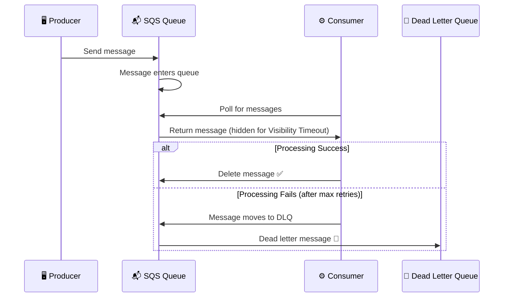
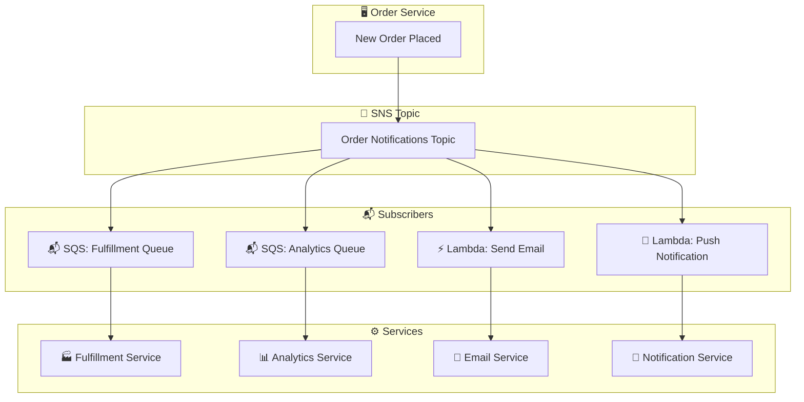
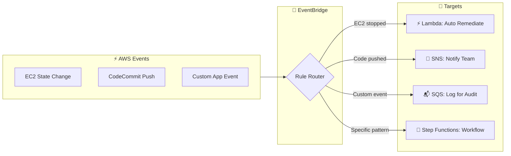

# 📨 AWS SNS, SQS & EventBridge - The Messaging Dream Team


> *"Don't couple your apps, Ravi! Let them talk through messages!"* - Every microservices architect 🗣️

---

## What is SNS and SQS?

---

## What Are These Three Services?

Hey Ravi! When your apps need to **communicate with each other**, you don't want them calling each other directly (that's called **tight coupling** and it's bad!). Instead, you use **messaging services** as the middleman.

| Service | What It Does | Analogy |
|---------|-------------|---------|
| 📢 **SNS** | Push messages to many subscribers | 📢 WhatsApp group broadcast |
| 📬 **SQS** | Queue messages for later processing | 📬 Email inbox |
| 🎯 **EventBridge** | Smart event routing | 🎯 Receptionist who routes calls |

---

## 📢 SNS - Simple Notification Service

### What is SNS?

SNS is a **pub/sub (publish/subscribe) messaging service**. You **publish** a message to a **topic**, and everyone **subscribed** to that topic gets the message. It's **push-based** - messages are pushed to subscribers!

### Key Features

| Feature | What It Does |
|---------|-------------|
| 📢 **Topics** | Logical channels for messages |
| 📱 **Subscriptions** | Email, SMS, HTTP, Lambda, SQS, and more |
| 🔀 **Fan-out** | One message → many subscribers |
| 📝 **Message Filtering** | Subscribers only get messages they care about |
| 🔒 **Encryption** | Messages encrypted at rest with KMS |
| 📊 **Delivery Status** | Track if messages were delivered |

### Fan-Out Pattern

```
         📢 SNS Topic
        / | | | \
       /  | | |  \
      📬  📬 ⚡ 📱 📧
     SQS SQS Lambda SMS Email
```

**One message, multiple destinations!** This is the famous **fan-out pattern**!

---

## 📬 SQS - Simple Queue Service

### What is SQS?

SQS is a **message queue** service. It's **pull-based** - consumers poll the queue for messages. It acts as a **buffer** between producers (senders) and consumers (receivers), **decoupling** your application components.

### Standard vs FIFO Queues

| Feature | 📬 Standard | 📋 FIFO |
|---------|-------------|---------|
| **Order** | ❌ Best effort | ✅ Strictly ordered |
| **Throughput** | ✅ Unlimited | ⚠️ 3000 msg/s (batch) |
| **Exactly-once** | ❌ At-least-once | ✅ Exactly-once |
| **Use Case** | Most workloads | When order matters |
| **Price** | 🆓 Cheaper | 💰 More expensive |

### Key Features

| Feature | What It Does |
|---------|-------------|
| ⏰ **Visibility Timeout** | Message hidden while being processed |
| 🔄 **Dead Letter Queue** | Catch messages that fail repeatedly |
| 📅 **Message Retention** | Keep messages up to 14 days |
| 🔁 **Delay Queue** | Delay message delivery up to 15 min |
| 📏 **Batching** | Send/receive up to 10 messages at once |
| 🔒 **Encryption** | Encrypted at rest with KMS |

### How SQS Works



---

## 🎯 EventBridge

### What is EventBridge?

EventBridge is a **serverless event bus** that makes it easy to connect your apps with AWS services. It's a **smart router** that routes events based on **rules** you define.

### Key Features

| Feature | What It Does |
|---------|-------------|
| 🎯 **Rules** | Route events to targets based on patterns |
| 🏗️ **Event Bus** | Default (AWS) or custom (your apps) |
| 📝 **Event Patterns** | Filter by source, detail type, etc. |
| 🔗 **Targets** | Lambda, SQS, SNS, Step Functions, and 18+ more |
| 📅 **Scheduled Rules** | Cron-based event generation |
| 🔍 **Schema Registry** | Discover and validate event schemas |

### EventBridge vs SNS vs SQS

| Feature | 📢 SNS | 📬 SQS | 🎯 EventBridge |
|---------|--------|--------|----------------|
| **Pattern** | Pub/Sub | Queue | Event-driven |
| **Direction** | Push | Pull | Push |
| **Routing** | Topic-based | Queue-based | Rule-based |
| **Filtering** | At subscription | Message attributes | Event patterns |
| **Best For** | Notifications | Decoupling | Complex event routing |

---

## 🏗️ Architecture Overview

### SNS → SQS Fan-Out Pattern



**Why this pattern?** If you add a new service, just subscribe it to the SNS topic. The Order Service doesn't need to know about it! **Loose coupling!** 🎉

### EventBridge Rule-Based Routing



---

## 🎯 Common Use Cases

| Use Case | Best Service | Why |
|----------|-------------|-----|
| 📧 Send email alerts | **SNS** | Built-in email subscription |
| 📬 Decouple microservices | **SQS** | Buffer between services |
| 🔄 Process orders asynchronously | **SQS + SNS** | Fan-out to multiple processors |
| ⏰ Schedule Lambda runs | **EventBridge** | Cron-based rules |
| 🚨 React to AWS events | **EventBridge** | Native AWS event integration |
| 📊 Log processing pipeline | **SQS → Lambda** | Buffer and process logs |
| 🔔 Real-time notifications | **SNS** | Push to mobile/email/SMS |
| 🎯 Route events by content | **EventBridge** | Pattern-based routing |

---

## ✅ Best Practices

| Practice | Service | Why |
|----------|---------|-----|
| 📬 Use SQS for decoupling | SQS | Prevents cascade failures |
| 📢 Use SNS for alerts | SNS | Fan-out to multiple channels |
| 🎯 Use EventBridge for routing | EventBridge | Flexible, serverless routing |
| 📋 Use FIFO for ordering | SQS | When sequence matters |
| 🚫 Use Dead Letter Queues | SQS | Catch poison messages |
| ⏰ Set Visibility Timeout | SQS | Prevent duplicate processing |
| 📊 Use SNS → SQS fan-out | Both | Decoupled notification system |
| 🔒 Enable encryption | All | Protect message content |

---

## ❌ Common Mistakes

| Mistake | What Happens | Fix |
|---------|-------------|-----|
| 🚫 Not setting visibility timeout | Messages processed multiple times | Set timeout > processing time |
| 💀 No Dead Letter Queue | Poison messages block queue | Always configure DLQ |
| 🔗 Tight coupling without messaging | Services fail together | Use SQS/SNS between services |
| 📢 Using SNS for one-to-one | Paying for pub/sub you don't need | Use SQS for point-to-point |
| 🚫 Not using fan-out | Missing notification destinations | Use SNS → SQS pattern |
| 📋 Using Standard when order matters | Out-of-order processing | Use FIFO queues |
| ⏰ Ignoring message retention | Messages expire (max 14 days) | Process or archive in time |
| 💰 Not batching messages | High API call costs | Batch send/receive operations |

---

## 🎤 Interview Questions

### 1️⃣ What is the difference between SNS and SQS?

**Answer:** **SNS** is **push-based** (pub/sub) - messages are pushed to all subscribers. **SQS** is **pull-based** (queue) - consumers poll for messages. SNS is for **broadcasting** (one-to-many). SQS is for **buffering** (one-to-one). They work great together in the fan-out pattern!

### 2️⃣ What is the SNS → SQS fan-out pattern?

**Answer:** You publish a message to an **SNS topic**, which has **SQS queues as subscribers**. Each SQS queue then feeds its own consumer service. This gives you **decoupled, scalable architecture** where adding new services is as easy as subscribing a new queue to the SNS topic.

### 3️⃣ When would you use SQS Standard vs SQS FIFO?

**Answer:** Use **Standard** for most workloads where order doesn't matter and you need high throughput. Use **FIFO** when **message ordering is critical** (e.g., financial transactions, order processing) or when you need **exactly-once processing**. FIFO has lower throughput limits.

### 4️⃣ What is a Dead Letter Queue and why is it important?

**Answer:** A **DLQ** is a queue where messages go after failing processing multiple times. It's crucial because **poison messages** (ones that always fail) can block the queue forever. The DLQ lets you **inspect failed messages** and fix the issue without blocking the main queue.

### 5️⃣ How does EventBridge differ from SNS?

**Answer:** **SNS** routes based on **topic subscriptions** (simple pub/sub). **EventBridge** routes based on **content patterns** in the event itself (e.g., "route EC2 events where state=stopped"). EventBridge has **18+ built-in targets** and native **AWS service integration**. Use SNS for simple notifications, EventBridge for complex event-driven architectures.

---

## 📋 Summary

| Service | Pattern | Best For |
|---------|---------|----------|
| 📢 **SNS** | Pub/Sub | Notifications, fan-out |
| 📬 **SQS** | Queue | Decoupling, buffering |
| 🎯 **EventBridge** | Event bus | Smart routing, automation |

Together, these three services form the **messaging backbone** of modern AWS architectures. Master them and you can build **decoupled, scalable, and resilient** systems! 🚀

---

## ➡️ Next Up: [19 - Lambda and API Gateway](../19%20-%20Lambda%20and%20API%20Gateway/README.md)

> Ready to go **serverless**? Let's build APIs without managing a single server! ⚡
