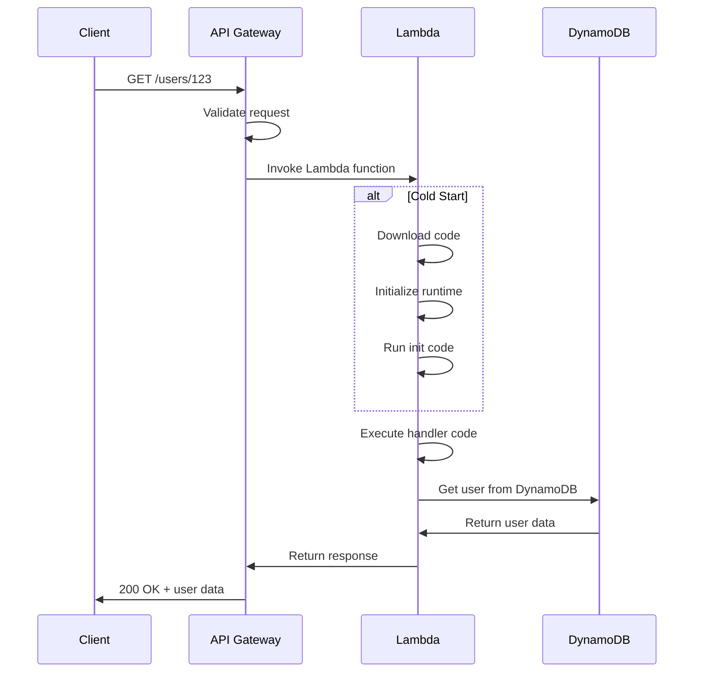
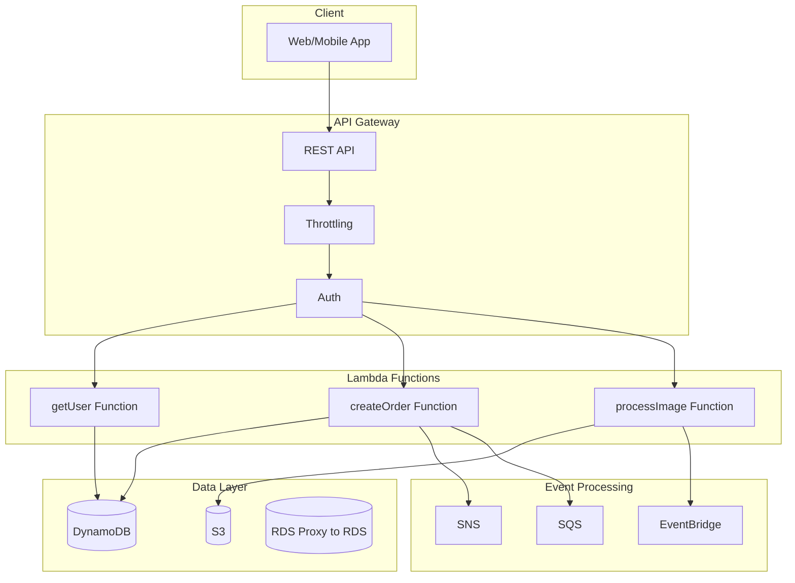
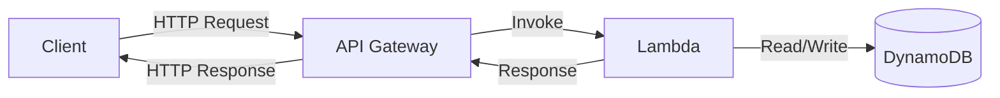

# AWS Lambda & API Gateway - Serverless Superpowers

> "Why manage servers when AWS can do it for you?" - Every serverless developer

---

## What is Lambda?

Hey Ravi! Imagine you could run code **without ever provisioning or managing servers**. No patching, no scaling, no 3 AM wake-up calls because a server crashed. That's **AWS Lambda**!

Lambda is a **serverless, event-driven compute service**. You upload your code, and Lambda runs it **only when triggered**, scaling automatically. You pay **only for the compute time** you use. No code running = no cost!

---

## Real-World Analogy: Food Delivery Chef

Ravi, think of it like this:

| Food Delivery | Lambda + API Gateway |
|--------------|---------------------|
| Delivery App | API Gateway (takes your order) |
| Chef | Lambda (cooks only when ordered) |
| Food Order | Event/Request (triggers the code) |
| Your House | Client (makes the request) |
| Kitchen | AWS Cloud (runs your code) |
| Pay per meal | Pay per request |

The chef doesn't stand around idle waiting for orders. They **only start cooking when an order comes in**. That's Lambda! You don't pay for idle time.

---

## How Lambda Works

### Lambda Lifecycle

### Cold Starts Explained

| Start Type | What Happens | Time |
|-----------|-------------|------|
| Cold Start | First invocation or after idle | 100ms - 10s+ |
| Warm Start | Subsequent invocations | 1-10ms |
| Frozen | After idle timeout | Cold start again |

**Tip:** Provisioned Concurrency keeps Lambda warm and ready to go!

---

## What is API Gateway?

API Gateway is a **fully managed service** that creates, publishes, and manages **APIs**. It acts as the **front door** for your Lambda functions, handling:

- **Request routing** to Lambda
- **Authentication and authorization**
- **Throttling and rate limiting**
- **API keys and usage plans**
- **Custom domains**
- **Caching**

### API Types

| Type | Use Case |
|------|----------|
| REST API | Traditional REST endpoints (most common) |
| HTTP API | Lightweight, cheaper, faster |
| WebSocket API | Real-time bidirectional communication |

---

## Key Features

### Lambda Features

| Feature | What It Does |
|---------|-------------|
| Max Timeout | 15 minutes |
| Max Memory | 128 MB to 10 GB |
| Deployment Package | Up to 250 MB (unzipped) |
| Layers | Share common code across functions |
| Supported Languages | Python, Node.js, Java, Go, C#, Ruby, and more |
| Environment Variables | Store config outside your code |
| Event Sources | 200+ AWS services can trigger Lambda |

### API Gateway Features

| Feature | What It Does |
|---------|-------------|
| Authorization | IAM, Cognito, Lambda authorizers |
| Throttling | Rate limiting (default 10,000 req/s) |
| Monitoring | CloudWatch metrics built-in |
| API Keys | Meter and charge for API usage |
| Custom Domains | Use your own domain name |
| Request/Response Transformation | Modify requests and responses |
| Caching | Cache responses to reduce Lambda calls |

---

## Architecture Overview

### Full Serverless Architecture

### How API Gateway + Lambda + DynamoDB Work Together

---

## Common Use Cases

| Use Case | Architecture | Why Lambda? |
|----------|-------------|-------------|
| REST API | API GW - Lambda - DynamoDB | No server management |
| File Processing | S3 - Lambda (resize image) | Event-driven, auto-scaling |
| Scheduled Tasks | EventBridge - Lambda (cron) | No always-on server needed |
| Chatbot | Lex - Lambda - DynamoDB | Pay per interaction |
| Data Pipeline | Kinesis - Lambda - S3 | Stream processing |
| Webhooks | API GW - Lambda - Process | Handle external callbacks |
| Microservices | API GW - Lambda - DB | Independent scaling per service |
| Email Processing | SES - Lambda - Action | React to incoming emails |

---

## Lambda Pricing

| Component | Cost |
|-----------|------|
| Free Tier | 1M requests/month, 400,000 GB-seconds |
| Requests | $0.20 per 1M requests |
| Duration | $0.0000166667 per GB-second |
| Provisioned Concurrency | $0.0000041667 per GB-second |

**Example:** A function that runs for 200ms with 256MB memory, 1M invocations/month:
- Cost: ~$0.20 (requests) + ~$0.33 (duration) = **~$0.53/month**

---

## Best Practices

| Practice | Why It Matters |
|----------|---------------|
| Keep functions small | Faster cold starts, easier debugging |
| Use Layers | Share code, reduce package size |
| Set proper timeouts | Prevent runaway executions |
| Use environment variables | No hardcoded secrets |
| Use Dead Letter Queues | Catch failed event processing |
| Monitor with CloudWatch | Track invocations, errors, duration |
| Do not log sensitive data | Security best practice |
| Set API Gateway throttling | Prevent abuse and cost overruns |
| Use connection pooling | Reuse DB connections (RDS Proxy) |
| Use Provisioned Concurrency | For latency-sensitive workloads |

---

## Common Mistakes

| Mistake | What Happens | Fix |
|---------|-------------|-----|
| Too much in one Lambda | Long cold starts, hard to debug | Split into smaller functions |
| Ignoring cold starts | Slow response times | Use Provisioned Concurrency |
| No Dead Letter Queue | Lost failed events | Configure DLQ for async invocations |
| Hardcoding secrets | Security risk | Use environment variables + Secrets Manager |
| Not setting memory | Poor performance | Right-size memory (more memory = more CPU) |
| No API Gateway throttling | Cost explosion from traffic spikes | Set rate and burst limits |
| Synchronous calls everywhere | Unnecessary cold starts | Use async invocations where possible |
| Not using Lambda Layers | Code duplication across functions | Extract shared code to layers |

---

## Interview Questions

### 1 What is a Lambda cold start and how do you reduce it?

**Answer:** A **cold start** happens when Lambda initializes a new execution environment (first call or after idle). It includes downloading code, starting the runtime, and running init code. To reduce cold starts: use **Provisioned Concurrency**, keep deployment packages **small**, avoid heavy initialization code, and use **warmer functions** for critical paths.

### 2 What is the difference between API Gateway REST API and HTTP API?

**Answer:** **REST API** has more features (caching, request validation, WAF integration, API keys) but costs more. **HTTP API** is lightweight, cheaper (about 70% less), and faster but has fewer features. Use HTTP API for simple Lambda integrations. Use REST API when you need advanced features like caching or WAF.

### 3 Can Lambda connect to an RDS database? What are the challenges?

**Answer:** Yes, but Lambda creates a **new connection** on each invocation, which can exhaust RDS connections. Solution: Use **RDS Proxy** to pool connections. RDS Proxy sits between Lambda and RDS, maintaining a pool of reusable connections. This is critical for production serverless applications.

### 4 How does API Gateway handle authentication?

**Answer:** API Gateway supports multiple auth methods: **IAM** (AWS credentials), **Cognito User Pools** (managed user auth), **Lambda Authorizers** (custom auth logic), and **API Keys** (simple key-based). Cognito is most common for user-facing apps. Lambda Authorizers give you full custom auth control.

### 5 What is the maximum timeout for a Lambda function?

**Answer:** **15 minutes** (900 seconds). For longer-running tasks, use **Step Functions** to orchestrate multiple Lambda calls, or use **Fargate/ECS** for workloads that need more time. If your Lambda is hitting the timeout limit, it's usually a sign you should break the work into smaller pieces.

---

## Summary

| Service | Purpose |
|---------|---------|
| Lambda | Serverless compute, run code without servers |
| API Gateway | Front door for APIs, routes requests to Lambda |

Lambda + API Gateway is the **foundation of serverless architecture** on AWS. Together they let you build APIs, process events, and run code without managing a single server. Master them and you're well on your way to being a serverless superhero!

---

## Next Up: [20 - ECS, ECR and EKS](../20%20-%20ECS%2C%20ECR%20and%20EKS/README.md)

> Lambda is great, but sometimes you need containers! Let's learn about ECS, ECR, and EKS!
